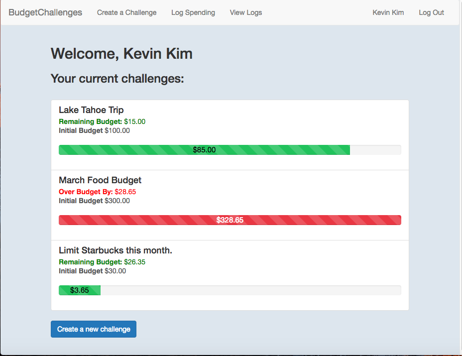
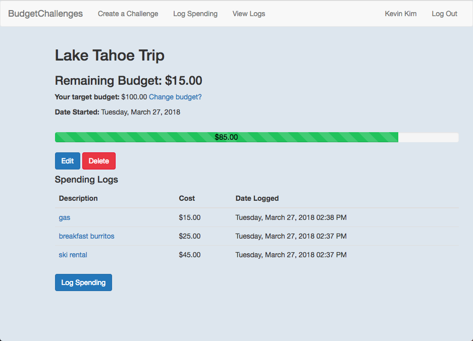
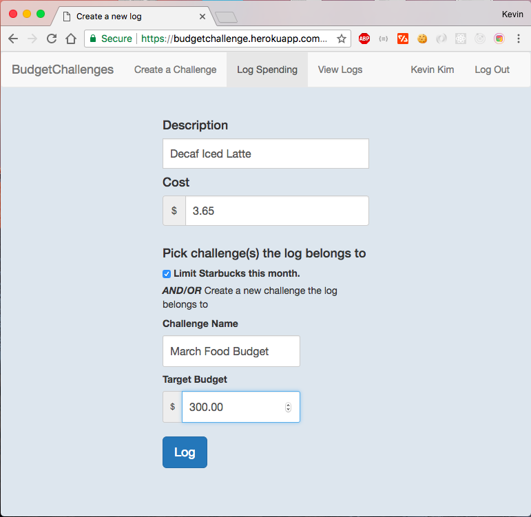

# BudgetChallenge

Set short term financial goals for yourself and make sure you don't go over-budget by creating several BudgetChallenges.   

Check out the demo [here](https://budgetchallenge.herokuapp.com//)





BudgetChallenge utilizes [Sinatra](http://sinatrarb.com/), SQLite3, and Bootstrap.

## Installation

To set up a local instance of BudgetChallenge, clone this repository, then run:

```
rake db:create
```
```
rake db:migrate
```
```
bundle install
```

## Usage

To run BudgetChallenge, in the terminal, type:

```
shotgun
```

then go to your local host in your browser (by default localhost:9393)

## Development

Developed by Kevin Y. Kim

## Contributing

Pull requests are welcome! Please follow the [Contributor's Code of Conduct](https://www.contributor-covenant.org/).
